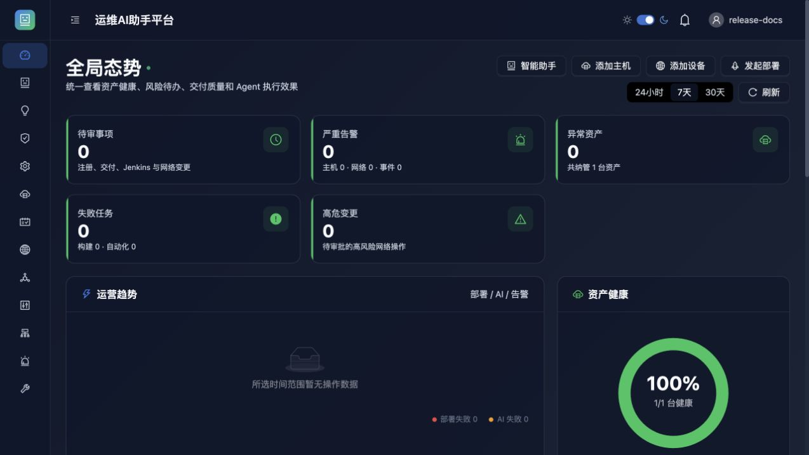
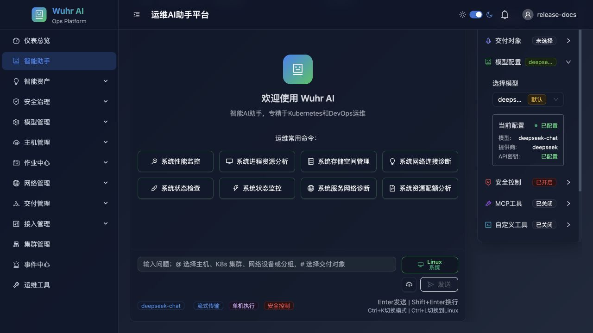
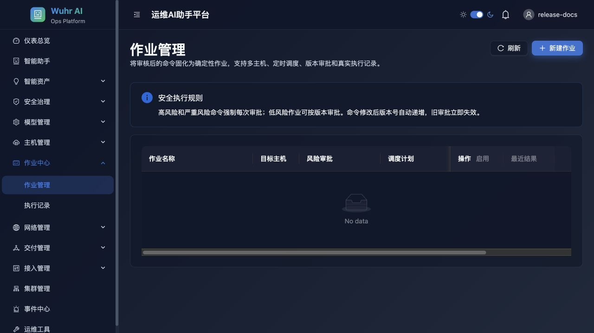
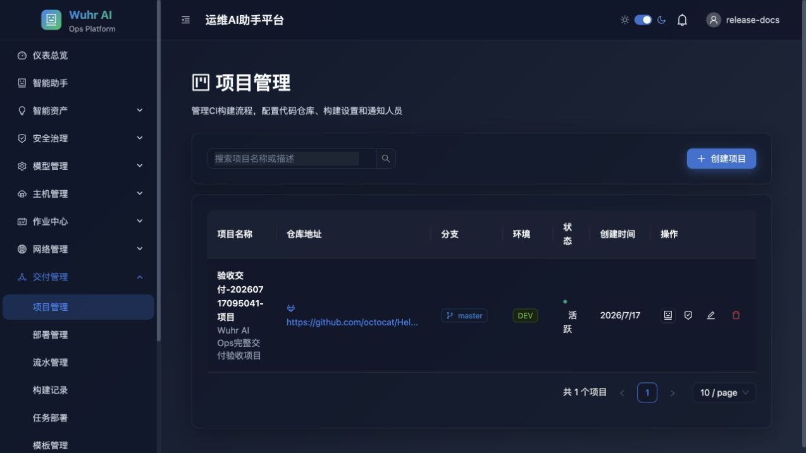
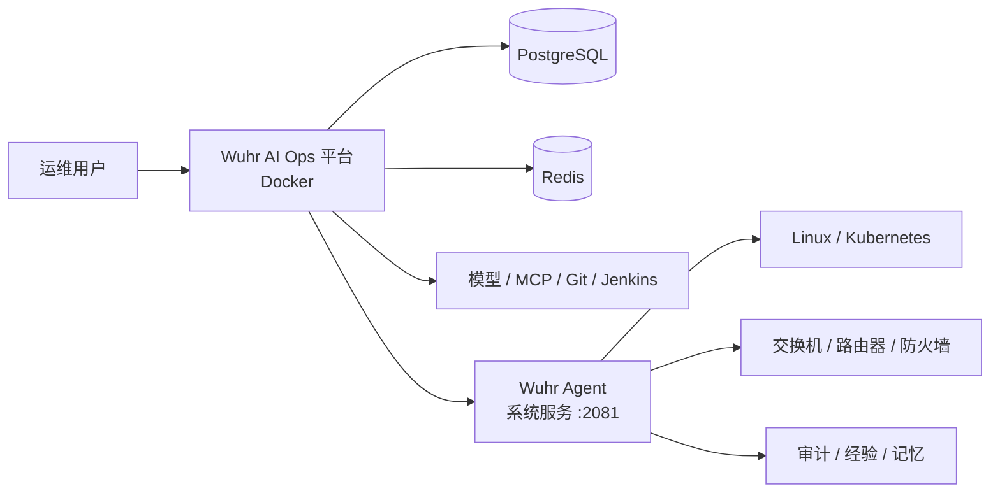

# Wuhr AI Ops 智能运维平台

<div align="center">

面向可信运维团队的 AI 运维控制平面：把主机、网络设备、Kubernetes、作业、审批与持续交付统一到一个可审计的工作台。

[安装部署](./docs/INSTALLATION.md) · [交付与审批](./docs/交付与审批流程使用手册.md) · [运维控制平面](./docs/运维控制平面使用手册.md)

</div>



## 平台解决什么问题

Wuhr AI Ops 不是只展示对话结果的聊天页面。它以 Agent 为执行面，以平台为控制面，将自然语言分析、真实命令执行、人工审批、批量作业、执行记录和 AI 总结串成一个可追踪闭环。

- 一次模型规划，多台目标复用同一组已审批命令，减少重复模型调用和 Token 消耗。
- `@主机名`、`@IP`、`@标签`、`@主机组` 直接选择单台或批量目标。
- 高风险或变更命令进入人工审批；审批、拒绝、执行和结果均持久化。
- 主机、交换机、路由器、防火墙与 Kubernetes 集群使用统一资源入口。
- CI/CD 项目、构建、流水线、部署、回滚和 AI 诊断在同一上下文内协作。
- 模型接入、MCP 工具与脚本工具分开管理，密钥在服务端加密保存。

## 核心能力

| 领域 | 能力 |
| --- | --- |
| 智能助手 | 多模型接入、资源 `@` 选择、单机/批量执行、命令审批、流式响应、结果总结、会话历史 |
| 智能资产 | 经验教训、执行结果、技能、长期记忆与团队知识的真实持久化 |
| 主机作业 | SSH 资产、主机分组、批量作业、定时计划、重试、取消、执行记录 |
| 网络运维 | 设备资产、设备分组、配置快照、拓扑、变更、巡检、告警与命令行执行 |
| 交付管理 | 项目、构建、流水线、部署、Jenkins、模板、审批、回滚与 AI 报告 |
| 安全治理 | 用户、角色权限、审批中心、消息通知、审计日志与凭据治理 |
| 系统接入 | Git、Jenkins、制品库、日志、监控与告警渠道 |
| 扩展能力 | OpenAI 兼容模型、主流模型厂商、MCP Server、自定义脚本与技能 |

## 智能助手

在会话设置中选择模型、目标资源、交付对象、MCP/脚本工具和安全策略。单个资源走单机执行；匹配多个资源时进入批量执行，模型先生成一次计划，平台在审批后复用命令执行，最后把所有目标的真实输出交给模型汇总。



推荐工作方式：

1. 输入 `@生产环境 检查磁盘和异常大文件，但不要删除`。
2. 核对匹配到的主机范围。
3. 查看模型生成的执行计划和风险级别。
4. 审批需要执行的命令。
5. 查看逐台实时结果、失败原因、整体总结与后续建议。

## 作业与交付

重复性的运维动作应保存为作业模板，由平台调度执行并持久化每次运行。应用交付则从项目与代码接入开始，经过构建、审批、部署、验证和回滚，AI 可以在构建失败、发布前评估、部署异常和发布后复盘阶段提供上下文分析。





## 安全边界

- Agent 默认开启 API Key 鉴权、限流、命令校验、特权命令阻断、审计和人工审批。
- 浏览器不直接持有 Agent API Key；平台服务端代理请求并附带用户身份。
- 模型密钥、SSH 凭据、Git/Jenkins 凭据由服务端加密保存。
- PostgreSQL 与 Redis 只在 Docker 内网开放，不映射宿主端口。
- 默认不自动修改客户防火墙；生产环境应限制 Agent 只接受平台来源流量。
- 执行历史、审批、AI 决策、作业和交付结果都是真实持久化记录，不使用模拟成功。

## 架构



平台前端、数据库、缓存和交付调度器由 Docker Compose 管理；Agent 不使用 Docker，直接注册到客户操作系统的服务管理器，以便调用本机运维工具并持久化审计数据。

## 快速安装

平台前端源码保存在本仓库，后端 Agent 只通过 GitHub Releases 和国内镜像提供编译包，不上传后端源码，也不上传前端 Docker 镜像。

### 整个平台一键部署

在 Linux 服务器克隆仓库后执行：

```bash
git clone https://github.com/st-lzh/Wuhr-AI-ops.git
cd Wuhr-AI-ops
sudo ./deploy.sh all
```

该命令会把 Agent 安装为宿主机系统服务，并通过 Docker Compose 构建和启动前端、PostgreSQL、Redis、交付调度器。初始管理员密码保存在 `.deploy/wuhr-ai-ops/initial-credentials.txt`。

如果 Agent 已经安装在另一台服务器，只部署 Docker 平台：

```bash
./deploy.sh platform \
  --agent-url http://10.0.0.20:2081 \
  --agent-api-key-file ./agent-api-key.txt
```

接管早期版本创建的同名数据卷时，必须显式导入原平台和 Agent 配置，脚本不会重置旧数据库或管理员密码：

```bash
./deploy.sh platform \
  --platform-env-file .env \
  --agent-env-file .env.local
```

部署状态、密钥和初始凭据保存在 Git 忽略的 `.deploy/项目名/`；PostgreSQL、Redis、平台数据和日志保存在 Docker 具名卷，重新创建容器不会删除数据。

安装后的常用命令：

```bash
# 查看首次登录凭据
cat .deploy/wuhr-ai-ops/initial-credentials.txt

# 验收平台、数据库、Redis、调度器和 Agent
./deploy.sh verify

# 查看平台与调度器日志
docker compose -p wuhr-ai-ops --env-file .deploy/wuhr-ai-ops/.env \
  -f docker-compose.deploy.yml logs -f --tail=200 app deployment-scheduler

# 停止容器但保留全部数据
./deploy.sh down
```

升级时先拉取新代码，再重新执行原部署模式。脚本会复用已有密钥和数据卷：

```bash
git pull --ff-only
sudo ./deploy.sh all
```

### 只安装后端 Agent

下载地址：

- [GitHub Release](https://github.com/st-lzh/Wuhr-AI-ops/releases/tag/v1.0.0)
- [国内下载镜像](http://106.12.150.207/download/)

在受管服务器安装后端 Agent：

```bash
tmp=$(mktemp) && trap 'rm -f "$tmp"' 0 HUP INT TERM \
  && (curl -fsSL 'https://github.com/st-lzh/Wuhr-AI-ops/releases/download/v1.0.0/install-agent.sh' -o "$tmp" \
  || curl -fsSL 'http://106.12.150.207/download/install-agent.sh' -o "$tmp") \
  && sudo sh "$tmp" --port=2081
```

下载器会识别 Linux/macOS 与 amd64/arm64，优先从 GitHub 下载对应后端包；GitHub 不可用、校验失败或超时时自动改用国内镜像。

平台与 Agent 分机部署、TLS、防火墙、升级、诊断和卸载说明见[安装与升级手册](./docs/INSTALLATION.md)。

## 发布物与源码边界

公开 Release 只包含 Linux/macOS、amd64/arm64 的 Wuhr Agent 分架构包、安装器与 SHA-256 校验文件。发布构建器会拒绝把 `.go`、`.ts`、`.tsx`、source map、`.env`、私钥或 `.git` 放入后端交付包。

## 浏览器与系统要求

- 平台服务器：Linux、Docker Engine、Docker Compose v2
- Agent：Linux 或 macOS，amd64 或 arm64
- 推荐：4 核 CPU、8 GiB 内存、20 GiB 可用磁盘
- 浏览器：最近两个大版本的 Chrome、Edge、Firefox 或 Safari

## 开发与反馈

问题反馈请使用 [GitHub Issues](https://github.com/st-lzh/Wuhr-AI-ops/issues)。提交问题时请附平台版本、Agent 版本、操作系统、复现步骤和脱敏后的错误日志；请勿提交 API Key、模型密钥、SSH 私钥或客户地址。
