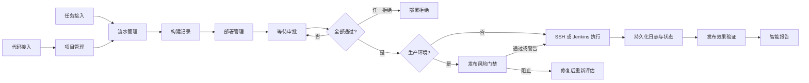

# 交付与审批流程使用手册

本文说明 Wuhr AI Ops 当前已经接通的代码接入、持续集成、部署审批、真实执行、AI 报告和回滚流程。文档以本地 Docker 运行的前端应用（`http://127.0.0.1:3000`）为准。

## 1. 流程总览



普通项目发布由应用通过 SSH 在目标主机执行已经保存并经过审批的脚本；Jenkins 项目由应用调用真实 Jenkins Job。项目、审批、部署状态、执行日志、通知和 AI 报告都写入 PostgreSQL，不依赖浏览器内存。

## 2. 使用前检查

1. 在“主机管理 → 主机列表”确认目标主机状态正常，并先通过连接测试。
2. 私有仓库需要先在“接入管理 → 代码接入”添加 Git 凭据。Token、密码或 SSH 私钥会加密保存，不会再次明文回显。
3. 使用 Jenkins 时，在“接入管理 → 任务接入”添加服务地址、用户名和 API Token，并点击“测试连接”。
4. 在“配置管理 → 模型管理”至少启用一个默认模型，否则 AI 报告会保留失败记录，但不会影响原始部署日志的保存。
5. 部署申请人需要 `cicd:write`；查看人员需要 `cicd:read`。审批人员应选择管理员、运维经理或具有 `cicd:write` 的成员。

## 3. 右上角审批通知

有待当前用户处理的审批时，页面右上角铃铛会显示数字角标。

- 登录后会立即读取已有待审批任务，不需要先打开通知下拉框。
- 用户在线时，新审批会通过 Redis 和 SSE 实时推送；用户离线时，审批记录和通知仍保存在数据库中，下次登录仍能看到。
- 点击铃铛后，“审批通知”页签只统计当前用户可以处理的待审批任务；“信息通知”单独计数，不会与审批重复相加。
- 可以在下拉框内直接点击“通过”或“拒绝”，也可以点击“查看审批管理”进入完整审批中心填写意见、查看历史记录。
- 多个审批人时，必须全部通过才会进入下一阶段；任意一人拒绝，部署状态即变为“已拒绝”。
- 审批完成后，对应角标和持久化通知会被清理，审批动作同时写入审计记录。

只有被指定为该任务审批人的账号可以处理审批；管理员可以代为处理。单纯拥有查看权限不会获得可操作的审批任务。

## 4. 标准交付流程

### 4.1 代码接入

进入“接入管理 → 代码接入”，点击“新增认证配置”：

1. 选择 GitHub、GitLab、Gitee 或其他 Git 平台。
2. 选择 Token、用户名密码或 SSH 密钥认证。
3. 可设为该平台的默认凭据并保存。

公开仓库可跳过这一步。私有仓库建议使用最小权限的 Personal Access Token 或专用部署密钥。

### 4.2 任务接入（使用 Jenkins 时）

进入“接入管理 → 任务接入”，新增 Jenkins 接入：

1. 填写配置名称、Jenkins 地址、用户名和 API Token。
2. 启用配置并保存。
3. 点击“测试连接”，确认返回连接成功后再创建流水线或任务部署。

### 4.3 创建项目

进入“交付管理 → 项目管理”，点击“创建项目”：

1. 填写项目名称、仓库地址、分支和环境。
2. 私有仓库选择前面创建的 Git 凭据，并完成仓库校验。
3. 填写真实构建脚本和部署脚本，例如 `npm ci && npm run build`。脚本为空时，系统不会伪造成功，部署会被阻止。
4. 按需配置环境变量、通知人员、审批人员和超时设置。

### 4.4 创建并执行流水线

进入“交付管理 → 流水管理”，创建流水线并选择项目：

1. 填写流水线名称和 Jenkins Job 名称。
2. 参数、触发器和阶段使用 JSON 配置。
3. 保存后点击执行按钮。
4. 在“交付管理 → 构建记录”查看排队、运行、成功或失败状态，以及真实构建日志和 Jenkins 链接。
5. 构建失败时可以点击 AI 诊断，或带着该构建上下文进入 AI 助手排查。

如果已有独立 Jenkins Job，不需要创建普通项目流水线，可直接使用“交付管理 → 任务部署”。

### 4.5 配置部署模板

进入“交付管理 → 模板管理”，保存经过团队审核的部署脚本。部署任务选择模板后，执行器优先使用模板内容，其次使用任务或项目上的部署脚本。

模板内容会在目标主机的 `bash` 中真实执行，应遵循以下要求：

- 使用 `set -euo pipefail`，遇到错误立即停止。
- 脚本可使用 `${DEPLOYMENT_ID}`、`${PROJECT_NAME}`、`${BUILD_NUMBER}`、`${ENVIRONMENT}` 和 `${VERSION}` 变量。
- 不在脚本中硬编码密码、Token 或私钥。
- 生产脚本应具备幂等性，同一版本重复执行不会破坏服务。

### 4.6 创建部署任务

进入“交付管理 → 部署管理”，点击“创建部署任务”：

1. 选择项目并填写部署名称、环境和版本号。
2. 选择部署模板和一台或多台目标主机。
3. 选择通知人员和审批人员。
4. 填写真实部署脚本或选择已审核模板；生产环境必须同时填写真实回滚脚本。
5. 创建任务。当前所有部署都会从“等待审批”开始，不能绕过审批直接执行。

“通知人员”只接收状态信息，“审批人员”负责做出通过或拒绝决定，两者可以不同。建议申请人不要同时作为唯一审批人。

计划部署时间会持久化。审批完成后，独立 `deployment-scheduler` 容器会轮询到期任务并通过带 HMAC 签名的内部接口原子领取任务；它不依赖浏览器页面或 Next.js 请求生命周期。应用重启、调度器重启或重复轮询不会重复领取同一任务。

部署任务只有在“等待审批、已拒绝或失败”状态下允许修改。修改目标主机、脚本、版本等执行配置后，旧审批会被删除并重新生成，防止出现“审批的是 A、执行的是 B”。

### 4.7 审批与质量门禁

审批人可以从两个入口操作：

1. 右上角铃铛 → “审批通知” → “通过/拒绝”。
2. 交付首页或铃铛底部 → “审批管理”，查看详情、填写意见后处理。

最后一名审批人通过后：

- 开发、测试环境会进入统一部署触发器并开始真实执行。
- 生产环境必须先有一份针对当前部署版本的“发布门禁”报告。若没有，任务保持“已审批”，不会偷偷执行。
- 门禁结论为 `block` 时禁止执行；修复阻断项后重新生成报告。
- 门禁为 `pass` 或 `warn` 时，在部署列表点击执行按钮启动部署。

### 4.8 查看执行结果

进入部署列表或部署详情：

- “实时日志”显示每台主机的 SSH 连接、脚本输出、退出码和最终结果。
- 多主机部署会逐台执行并汇总；任一主机失败，整次部署记为失败，不会显示伪成功。
- Jenkins 部署会记录队列号、构建号、控制台日志和最终结果。
- 部署成功后会异步生成“发布后效果验证”报告，并保存在“交付管理 → 智能报告”。生成失败也会保留失败原因。

## 5. AI 助手结合交付对象

交付页面的 AI 按钮只携带数据库对象 ID 和分析意图，不会在打开页面时自动执行构建、部署或回滚。

也可以进入“AI 资产 → AI 助手”，在交付上下文中选择项目、流水线、构建记录或部署任务，然后提问，例如：

- “分析这次构建失败的根因，并按证据排序。”
- “评估这个生产部署的风险和回滚条件。”
- “总结这次五台主机部署的结果并给出后续建议。”

AI 给出的高风险操作仍需走审批和真实执行接口，不能仅凭对话直接绕过安全控制。

## 6. 回滚流程

部署成功、失败或已取消后，可在部署详情点击“回滚部署”，填写目标版本和回滚原因。

系统只会执行部署记录中已经持久化的 `rollbackScript`；没有真实回滚脚本时会明确阻止操作。当前网页模板主要维护部署脚本，因此正式使用回滚前，应先通过部署 API 或后续回滚模板配置将经过审核的 `rollbackScript` 保存到任务中，并在测试环境演练。

回滚会继续使用原目标主机，保存每台主机的输出、最终状态、操作者、目标版本和原因。

## 7. 状态说明

| 状态 | 含义 | 下一步 |
| --- | --- | --- |
| `pending` | 等待审批 | 审批人处理 |
| `approved` | 全部审批通过，尚未执行 | 完成生产门禁或点击执行 |
| `rejected` | 至少一人拒绝 | 修改后重新创建任务 |
| `deploying` | 正在通过 SSH 或 Jenkins 执行 | 查看实时日志 |
| `success` | 所有目标执行成功 | 查看效果验证报告 |
| `failed` | 至少一个目标失败或执行异常 | 查看日志、AI 诊断或回滚 |
| `cancelled` | 用户已停止任务 | 确认远端状态后重试或回滚 |
| `rolled_back` | 回滚脚本执行成功 | 验证业务和版本 |

## 8. 数据持久化与容器重启

以下数据不保存在浏览器里：项目、流水线、构建、部署、审批、通知、审计日志和 AI 报告均在 PostgreSQL；实时/离线通知队列使用带 AOF 的 Redis；工作数据和日志使用 Docker 挂载目录或 volume。

安全操作：

```bash
docker compose restart app
docker compose up -d --build app
docker compose down
docker compose up -d
```

以上操作不会删除 PostgreSQL volume，容器重建后交付记录仍然存在。不要执行下面的命令，除非确定要删除全部数据库和 Redis 数据：

```bash
docker compose down -v
```

建议在重大升级前备份 PostgreSQL volume，并保留 `.env.local`、`data/` 和 `deployments/` 挂载目录。

## 9. 常见问题

### 有审批记录但铃铛没有角标

1. 确认当前登录账号就是指定审批人。
2. 确认账号具有 `cicd:write`，并刷新页面。
3. 打开铃铛检查“审批通知”，再查看“审批管理”。
4. 检查应用日志中 `/api/notifications/pending-approvals`、`/api/notifications/realtime` 和 Redis 连接是否成功。

### 点击通过后没有立刻执行

- 多人审批时，确认是否还有其他待审批人。
- 生产环境会等待最新发布门禁报告，这是安全设计，不是卡住。
- 门禁为 `block` 时必须先修复问题并重新生成报告。

### 部署失败

1. 先在主机列表重新测试 SSH。
2. 查看部署详情的真实日志和远端退出码。
3. 检查模板或项目是否保存了真实部署脚本。
4. 使用部署记录的 AI 诊断入口做总结，原始日志仍是最终依据。

### AI 报告没有生成

检查默认模型是否启用、API Key 和 Base URL 是否有效。报告生成失败会在“智能报告”中留下失败记录和原因，不会覆盖部署原始结果。
